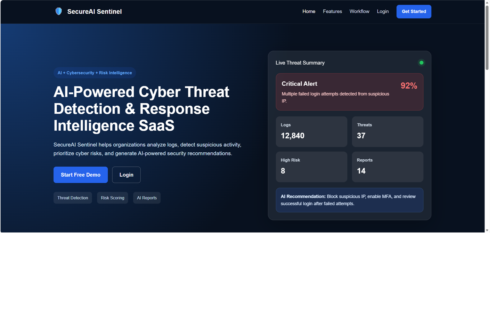
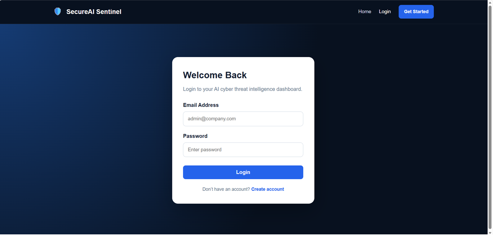
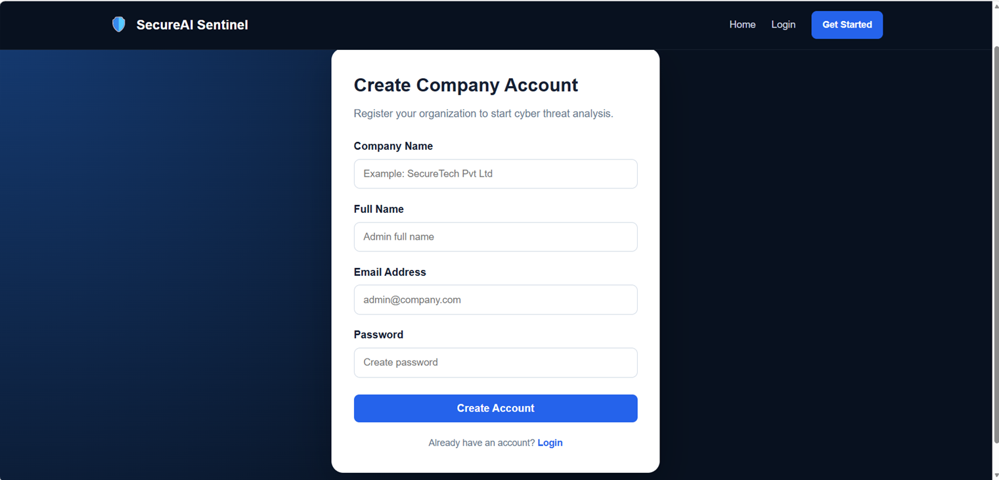
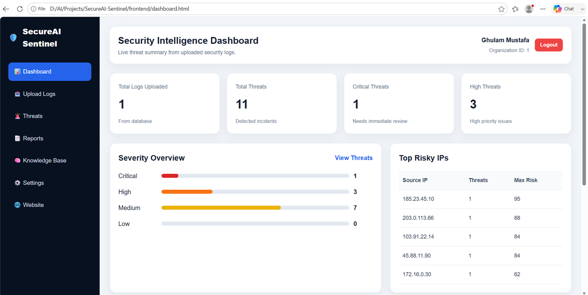
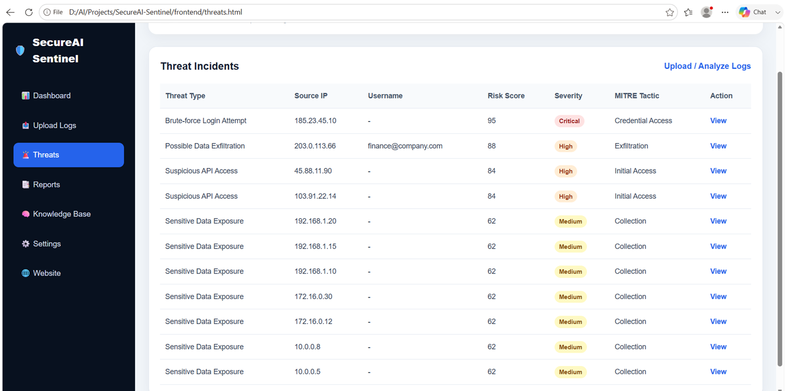
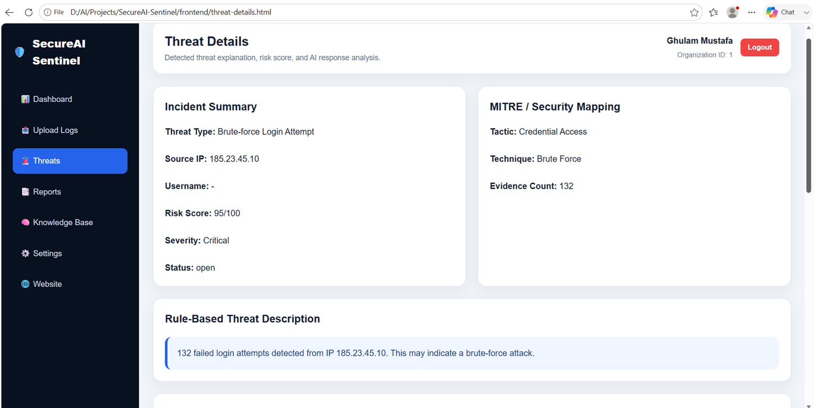

# SecureAI Sentinel

**AI-Powered Cyber Threat Detection & Response Intelligence Dashboard**

SecureAI Sentinel is a frontend portfolio demo for an AI-powered cybersecurity SaaS platform. It is designed to help organizations analyze security logs, detect suspicious activities, view cyber threat intelligence, generate incident reports, and present AI-assisted threat explanations through a clean and professional dashboard interface.

> **Note:** This public repository contains the frontend UI only. The backend API, database, log analysis engine, threat detection logic, and AI threat analysis modules are developed privately/local for demonstration purposes.

---

## Project Overview

SecureAI Sentinel focuses on defensive cybersecurity. The system is designed to reduce alert overload and help security teams quickly understand suspicious activity through dashboards, risk scoring, threat details, MITRE mapping, incident reports, and AI-based analysis.

This frontend represents the user interface of the complete product.

---

## Key Features

* Modern cybersecurity SaaS landing page
* Company registration and login interface
* Security intelligence dashboard
* Log upload and analysis interface
* Detected threat incidents page
* Threat details and AI explanation screen
* Real-time style risk summary cards
* Severity overview and risky IPs section
* Professional incident report layout
* Cyber knowledge base page
* System settings page
* Clean HTML, CSS, and JavaScript structure

---

## Screenshots

### Landing Page

### Login Page

### Register Page

### Security Dashboard

### Threat List

### Threat Details

---

## Frontend Pages

* `index.html` — Landing page
* `login.html` — Login page
* `register.html` — Company registration page
* `dashboard.html` — Security intelligence dashboard
* `upload-logs.html` — Log upload and analysis page
* `threats.html` — Detected threats list
* `threat-details.html` — Threat detail and AI explanation page
* `reports.html` — Security incident reports
* `knowledge-base.html` — Cyber knowledge base
* `settings.html` — System settings page

---

## Tech Stack

* HTML5
* CSS3
* JavaScript
* Responsive dashboard layout
* Cybersecurity-focused UI design

---

## Private Backend Features

The private/local backend version includes:

* FastAPI backend
* PostgreSQL database
* SQLAlchemy ORM
* JWT authentication
* Protected routes
* CSV log upload
* Uploaded log delete option
* Rule-based threat detection
* Risk scoring
* MITRE ATT&CK mapping
* Dashboard summary APIs
* Incident report generation
* AI-powered threat explanation using local LLM integration

---

## Threat Types Covered

The private backend detection engine currently supports:

* Brute-force login attempts
* Suspicious API access
* Possible data exfiltration
* Sensitive data exposure

---

## AI Capabilities

The private AI module is designed to generate:

* Executive summary
* Business impact
* Technical analysis
* Recommended defensive response
* AI-assisted incident explanation

---

## Purpose

This project demonstrates my ability to design and develop an AI + cybersecurity SaaS interface with real-world product structure, including authentication screens, dashboard analytics, threat intelligence views, incident reporting, knowledge base, and AI-assisted security analysis.

---

## Future Improvements

* Full backend deployment
* PDF report download
* RAG-based cyber knowledge engine
* Vector database integration
* Role-based access control
* Audit logs
* Rate limiting
* Email notifications
* Multi-tenant admin panel
* Cloud deployment

---

## Author

**Ghulam Mustafa**
AI Engineer | FastAPI Developer | Cybersecurity AI Enthusiast
