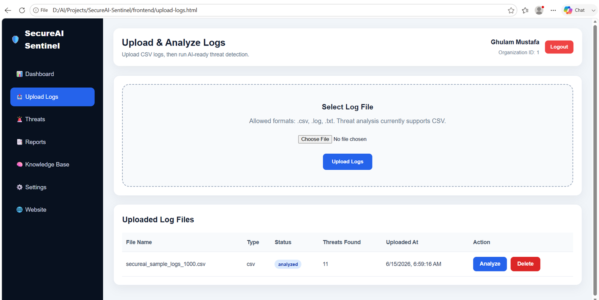

# SecureAI Sentinel

**AI-Powered Cyber Threat Detection & Response Intelligence Dashboard**

SecureAI Sentinel is a frontend portfolio demo for an AI-powered cybersecurity SaaS platform. It is designed to help organizations upload security logs, detect suspicious activities, view threat intelligence, generate incident reports, and present AI-assisted threat explanations in a clean security dashboard.

> **Note:** This public repository contains the frontend UI. The backend API, database, log analysis engine, and AI threat analysis modules are developed privately/local for demonstration purposes.

---

## Project Highlights

- Modern cybersecurity SaaS landing page
- Company registration and login UI
- Protected security dashboard interface
- Log upload and analysis screen
- Threat incident listing page
- Threat detail and AI explanation page
- Real-time style risk dashboard
- Professional incident report layout
- Knowledge base and settings pages
- Clean HTML, CSS, and JavaScript frontend

---

## Screenshots

### Landing Page

### Login Page

### Register Page

### Security Dashboard

### Upload Logs

### Threat List

### Threat Details

---

## Frontend Pages

- `index.html` — Landing page
- `login.html` — Login page
- `register.html` — Company registration page
- `dashboard.html` — Security intelligence dashboard
- `upload-logs.html` — Log upload and analysis page
- `threats.html` — Detected threats list
- `threat-details.html` — Threat detail and AI explanation page
- `reports.html` — Security incident reports
- `knowledge-base.html` — Cyber knowledge base
- `settings.html` — System settings page

---

## Tech Stack

- HTML5
- CSS3
- JavaScript
- Responsive dashboard layout
- Cybersecurity-focused UI design

---

## Private Backend Features

The private/local backend version includes:

- FastAPI backend
- PostgreSQL database
- JWT authentication
- CSV log upload
- Rule-based threat detection
- Risk scoring
- MITRE ATT&CK mapping
- Incident report generation
- AI-powered threat explanation using local LLM integration

---

## Threat Types Covered

- Brute-force login attempts
- Suspicious API access
- Possible data exfiltration
- Sensitive data exposure

---

## Purpose

This project demonstrates my ability to design and build an AI + cybersecurity product interface with real-world SaaS structure, including dashboards, security workflows, incident reporting, and AI-assisted threat intelligence.

---

## Author

**Ghulam Mustafa**  
AI Engineer | FastAPI Developer | Cybersecurity AI Enthusiast
